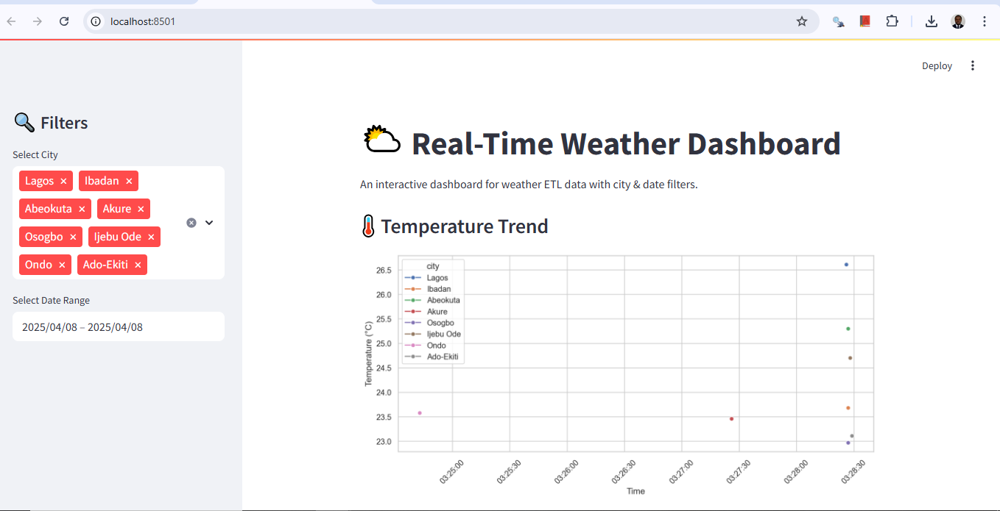
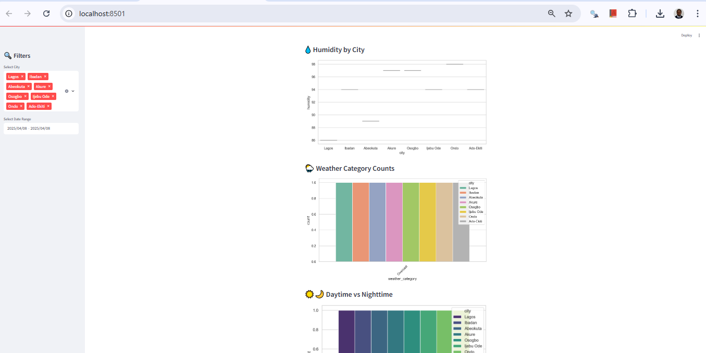

# 🌦️ Weather ETL Pipeline with Visualization

An end-to-end pipeline to extract real-time weather data from OpenWeatherMap, transform and store it in an SQLite database, and visualize it through a Streamlit dashboard.

---

## 📊 Dashboard Preview

> Screenshots of the live dashboard.




---

## 🚀 Features

- Fetches live weather data from OpenWeatherMap API
- Transforms and categorizes raw weather data
- Automatic scheduling with `schedule` module
- Clean and structured database using SQLite
- Visualize weather trends using Seaborn & Matplotlib
- Interactive Streamlit dashboard with filters
- Logging for error tracing

---
## 📁 Project Structure

```
weather-etl/
├── assets/               # Screenshots or UI images
├── data/                 # Contains the weather_data.db
├── logs/                 # Log files
├── visuals/              # Saved matplotlib/seaborn plots
├── src/
│   ├── etl.py            # ETL logic
│   ├── main.py           # Main ETL runner
│   └── scheduler.py      # Scheduler script
├── config/
│   ├── settings.py       # API key, cities
│   └── logger.py         # Logging config
├── app.py                # Streamlit dashboard
├── requirements.txt      # Project dependencies
├── README.md             # You’re reading it!
├── LICENSE               # MIT license
└── .gitignore
```

## 🧰 Installation

```bash
git clone https://github.com/mustapha-shomorin/weather-etl.git
cd weather-etl
pip install -r requirements.txt
```

## ⚙️ Run ETL

```bash
python src/main.py
```

## 💻 Run Streamlit App

```bash
streamlit run app.py
```

## ⏱️ Run Scheduler

```bash
python src/scheduler.py
```

---

## 📝 License

This project is licensed under the [MIT License](LICENSE).

---

## 🧠 Author

**Mustapha Shomorin**  
[LinkedIn](https://www.linkedin.com/in/mustapha-shomorin)